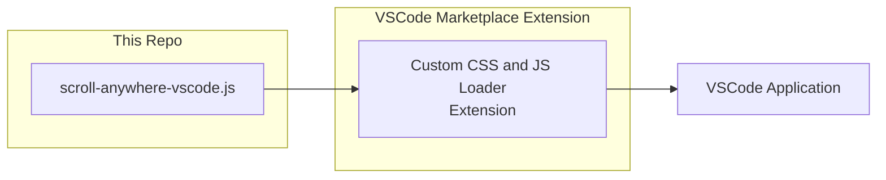

# Scroll Anywhere for VSCode

<br><a href="README FILES/vscode-scrollanywhere-demo.gif" target="_blank">
  
</a>

This extension enables middle mouse **grab-and-drag** scrolling with **momentum** inside VSCode
<br>Flick the editor to scroll and let it coast to a stop, the same way you scroll on a phone or tablet
<br>Works in the editor, the sidebar, panels, and other scrollable lists
<br>
<br>Inspired by the [ScrollAnywhere](https://addons.mozilla.org/firefox/addon/scroll_anywhere/) Firefox extension

## Requirements

- [VSCode](https://code.visualstudio.com/) - or VSCodium
- [Custom CSS and JS Loader](https://marketplace.visualstudio.com/items?itemName=be5invis.vscode-custom-css) VSCode extension

## Overview
<br>This is a **userscript.js** that runs inside the VSCode window via the
**Custom CSS and JS Loader** extension, which injects a JavaScript file into the editor like so:



## Installation

1. **Install the Custom CSS and JS Loader Extension in VSCode.**
   <br>In VSCode, open Extensions and install
   *Custom CSS and JS Loader* (`be5invis.vscode-custom-css`)

2. **Save the scroll-anywhere-vscode.js script from this repo somewhere in your VSCode extensions folder**
   <br>Some good locations are...
   - macOS / Linux: `~/.vscode/scroll-anywhere-vscode.js`
   - Windows: `C:\Users\<you>\.vscode\extensions\scroll-anywhere-vscode.js`

3. **Point the Custom CSS loader at the script.** 
   <br>Open your `settings.json`
   <br>**Command Palette `Ctrl + Shift + P` → Preferences: Open User Settings (JSON)** and add these lines of code:

   ```jsonc
   // macOS / Linux
   "vscode_custom_css.imports": [
     "file:///home/you/.vscode/extensions/scroll-anywhere-vscode.js"
   ]
   ```
   ```jsonc
   // Windows - note the forward slashes, since VSCode loads stuff as an HTML path.
   "vscode_custom_css.imports": [
     "file:///C:/Users/you/.vscode/extensions/scroll-anywhere-vscode.js"
   ]
   ```

4. **Enable addon.**
   <br>**Command Palette `Ctrl + Shift + P` → Reload Custom CSS and JS → Restart Visual Studio Code**

## Recommended VSCode settings

To improve the feel of using this addon, modify these two settings in `settings.json`:

```jsonc
"editor.smoothScrolling": false,             // We keep this set to false, since it interferes with the addon's mouse momentum settings
"editor.mouseWheelScrollSensitivity": 1      // Keep this set to 1, since our scroll-anywhere-vscode.js file has more granular ways to modify these values
```

## Configuration

All options to modify this addon live in the `CONFIG` block at the top of the script
<br>To edit them, open and modify the `scroll-anywhere-vscode.js` file, then save and run <br>**Command Palette `Ctrl + Shift + P` → Reload Custom CSS and JS → Restart Visual Studio Code** to apply

| Option | Default | What it does |
| --- | --- | --- |
| `dragButton` | `1` | Mouse button to drag with: `0` left, `1` middle, `2` right |
| `dragMultiplier` | `1.5` | Drag speed. Higher number scrolls faster than the hand moves |
| `flickMultiplier` | `1.5` | Scales **momentum/flick** speed only, independent of the mouse dragging speed |
| `dragThreshold` | `3` | Pixels of movement before a press counts as a drag vs. a click (There's probably no need to adjust this unless you have a super high DPI monitor) |
| `momentumMultiplier` | `900` | Glide length: ms of coast per unit of flick speed. Higher number = longer coast |
| `minMomentumSpeed` | `0.02` | px/ms. Flicks slower than this just stop with no momentum coast (Once again, there's probably no need to adjust this unless you have a super high DPI monitor) |
| `flickWindowMs` | `50` | Time window used to measure release velocity. Shorter time = snappier and more responsive to a late flick; longer time = steadier |
| `useCoalesced` | `true` | Enabling this makes the addon work better with high-Hz mice. |
| `onlyInScrollables` | `true` | Restrict dragging to `.monaco-scrollable-element` panes |

## How it works

VS Code's editor (Monaco) is **virtualized**: line elements are recycled as they
scroll out of view, and setting `scrollTop` on the editor does nothing. So the
script:

1. On middle-press, resolves the **stable scroll container**
   (`.monaco-scrollable-element`) under the cursor and targets it
2. Scrolls by dispatching synthetic **`wheel` events**
   Since this works for any monaco element, this means it also works in the sidebar, panels, and lists
3. Measures release velocity over a **fixed time window** (not a fixed sample
   count), optionally fed by `getCoalescedEvents()` for full mouse resolution, so
   the flick should feel identical at any refresh rate
4. Applies **uniformly decelerated** momentum - `x(t) = v₀·t − ½·a·t²`, with
   velocity falling linearly to exactly zero

## Troubleshooting

- **"Installation is corrupt" warning** - expected after enabling; dismiss it
- **Script broke after a VSCode update** - Command Palette ``Ctrl + Shift + P`` →  Reload Custom CSS and JS → Restart Visual Studio Code 
- **Middle-click paste is suppressed** in the editor, since the middle button is
  the drag trigger. Change `dragButton` if you rely on middle-click paste

---


## Uninstalling

1. Command Palette → *Disable Custom CSS and JS*.
2. Remove the entry from the `"vscode_custom_css.imports"` row inside `settings.json`.
3. Optionally uninstall the Custom CSS and JS Loader extension.
